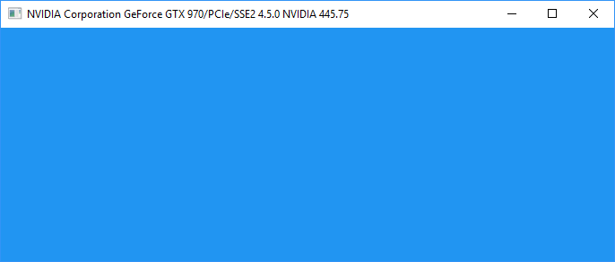

# win32_gl
Header file only library for opening an opengl context and window on win32

## Usage
See example folder on how to use the header file, as well as how to use Glad to load OpenGL functions

## Screenshot

